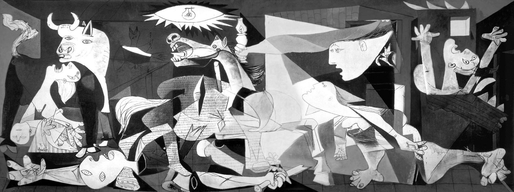
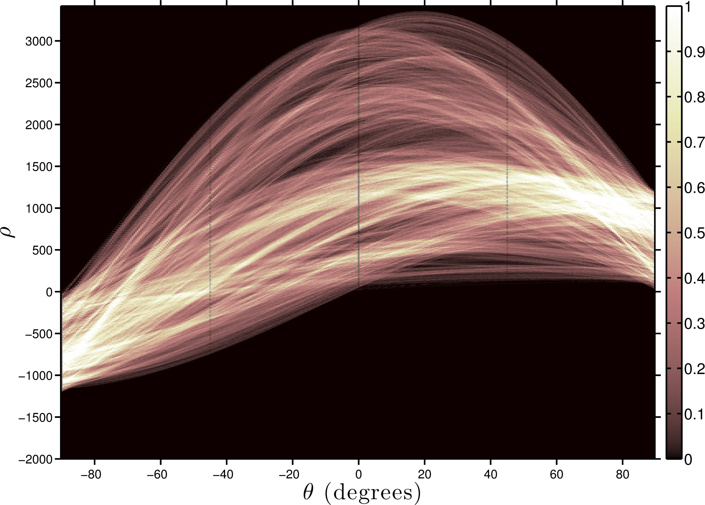

# Picasso^2 art

Detecting lines in Picasso's [Guernica](http://en.wikipedia.org/wiki/Guernica_(painting)) and making art of it. 

1) Gray scale edge detection using the Sobel method

2) [Standar Hugh transform](http://en.wikipedia.org/wiki/Hough_transform) of the detected edges. The color represents the count of points that have given rho (distance from the origin) and theta (angle of the line). The peaks of this map correspond to straight lines in the original image.

3) After making it pretty we have 

